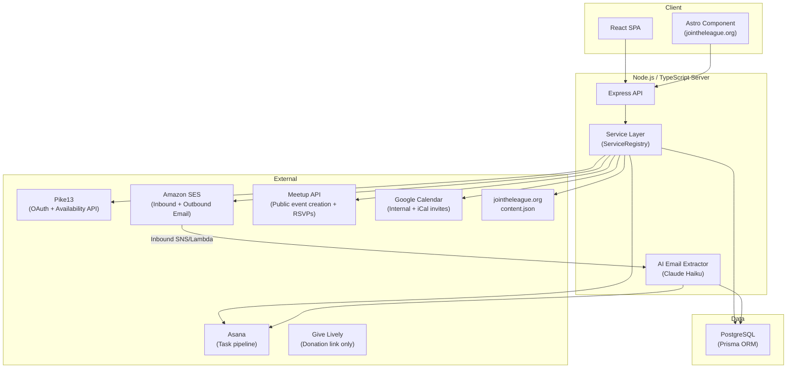
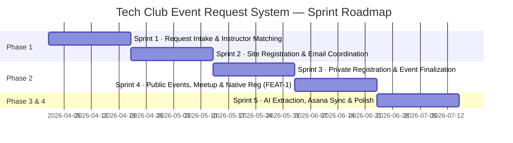

# Project Overview

## Project Name

Tech Club Event Request System — The League of Amazing Programmers

## Problem Statement

The League of Amazing Programmers runs free Tech Club events (coding, robotics, game design) at libraries, schools, and community centers. Today every event is initiated by League staff who manually reach out to venues, coordinate instructors, manage schedules, and handle promotion. This process does not scale and leaves community demand unmet: parents, teachers, and group leaders who want to bring a class to their community have no self-service path.

The system replaces manual outreach with a demand-driven workflow. Community members request events; the system matches requests against instructor availability and geography, creates a structured coordination thread, and handles registration and promotion for confirmed events.

## Target Users

| Role | Who | Primary Needs |
|------|-----|---------------|
| **Requester** | Parent, teacher, scout leader, group organizer | Browse requestable classes, submit a request, share registration links, track event status |
| **Instructor** | Volunteer or League staff | Log in via Pike13, set availability and topic preferences, accept/decline assignments, view assigned events |
| **Site Representative** | Library manager, school principal, science center coordinator | Register a venue via tokenized link, maintain site details, be added automatically to event coordination threads |
| **Admin** | League staff (Jed + others) | Manage the full request pipeline, configure events, send site invitations, sync with Asana |
| **Attendee** | Kids and families | Register for confirmed events, vote on dates (private events), receive calendar invites |

## Key Constraints

- **No requester or attendee accounts.** Requesters and attendees access their pages via obscure URLs sent by email. No login required.
- **Content is external.** Class descriptions, age ranges, topics, and equipment needs come from jointheleague.org's `content.json`. The app stores no class content locally.
- **Pike13 is the identity provider** for instructors and admins. Site representatives use magic-link email login (optional Google OAuth).
- **Amazon SES routing** must be configured before per-request email addresses can be issued. This is an infrastructure dependency for Phase 1.
- **Equipment reservation API contract** is not yet finalized — the inventory integration is a Phase 3 item pending external coordination.
- **Instructor reminder cadence and date-voting deadlines** are configurable but defaults are TBD — placeholders can ship and be tuned post-launch.
- **Technology:** Node.js + TypeScript (server), React (client), PostgreSQL + Prisma (database), hosted on this Docker-Node template stack.

## High-Level Requirements

The following scenarios define the must-pass acceptance bar for v1:

1. A requester enters a zip code and class topic; the system shows available instructor windows or reports no coverage.
2. A requester completes the intake form (including optional external registration URL) and receives a verification email; the request moves to `new` after verification and auto-expires if unverified within one hour.
3. A verified request generates a per-request email address, an Asana task, and notifications to admins and matched instructors.
4. An instructor logs in via Pike13 OAuth, sets up their profile (topics, geography), and receives assignment requests they can accept or decline.
5. A site representative follows a tokenized link, registers a venue, and is automatically included on email threads when their site is selected.
6. A private event generates a shareable registration link; attendees vote on dates; when the minimum headcount is met the date is confirmed and iCal invites are sent.
7. A public event triggers Meetup event creation; RSVPs are periodically synced; a registration digest is sent to the event thread.
8. For public events with native registration enabled (FEAT-1): parents register children directly on jointheleague.org; unified capacity tracks native + Meetup registrations; the Meetup RSVP limit is adjusted programmatically.
9. An admin can view all requests in a dashboard, change event parameters, confirm or cancel events, and manage registered sites.
10. Status changes in Asana propagate back to the event app (bidirectional sync via webhooks).

## Technology Stack

**Stack summary:**

| Layer | Technology |
|-------|-----------|
| Runtime | Node.js + TypeScript |
| API framework | Express |
| Frontend | React (admin/instructor UI), Astro component (jointheleague.org registration) |
| Database | PostgreSQL via Prisma ORM |
| Auth | Pike13 OAuth (instructors/admins), magic-link email + optional Google OAuth (site reps) |
| Email | Amazon SES (inbound routing + outbound) |
| AI extraction | Claude Haiku (read-only email processing) |
| Integrations | Pike13, Meetup, Asana, Google Calendar, Amazon SES, jointheleague.org content.json |
| Infrastructure | Docker (this template), dotconfig + age encryption for secrets |

## Sprint Roadmap

The spec's four-phase plan maps to five sprints. FEAT-1 (native registration) slots into Phase 2.

### Sprint 1 — Request Intake & Instructor Matching
- Class catalog from content.json (requestable flag)
- Request intake form with zip code, date selection, group details, site picker (free-text only), optional external registration URL
- Instructor profiles (topics, geography) + Pike13 OAuth login
- Geographic/topic matching (zip centroid distance)
- Pike13 availability reading and date aggregation
- Instructor consent flow with configurable reminders
- Request verification email + one-hour expiry
- Request status lifecycle (unverified → new → discussing → …)

### Sprint 2 — Site Registration & Email Coordination
- Tokenized site registration invitation (admin sends → site rep registers)
- Site representative accounts: magic-link login + optional Google OAuth
- Registered site data model and admin management dashboard
- Site picker on intake form (registered site + free-text fallback)
- Per-request email address provisioning (Amazon SES)
- Automatic addition of site reps to email threads
- Asana task creation on request verification
- Admin dashboard: view/manage all requests

### Sprint 3 — Private Registration & Event Finalization
- Shareable registration link for confirmed private events
- Date voting (check all dates that work)
- Minimum headcount threshold logic and date finalization
- iCal invite generation and delivery to confirmed attendees
- Notification to registrants on non-selected dates
- Google Calendar event creation (internal)
- Pike13 write-back: book instructor when event confirmed
- Admin controls: configure min headcount, voting deadline, confirm/cancel events

### Sprint 4 — Public Events, Meetup & Native Registration (FEAT-1)
- Meetup event creation via API (with external registration link in description)
- Periodic Meetup RSVP sync
- Registration digest emails to event thread
- **FEAT-1 Phase 2a:** Native registration API (guardian + children, volunteer role), event capacity model
- **FEAT-1 Phase 2b:** Unified capacity tracking (native + Meetup heuristic), programmatic Meetup RSVP limit adjustment, waitlist
- **FEAT-1 Phase 2b:** Astro component on jointheleague.org (three states: open / full / no event scheduled)
- **FEAT-1 Phase 2c:** Post-event attendance reconciliation tool (instructor/admin)
- Duplicate detection across native and Meetup registrations (best-effort name match)

### Sprint 5 — AI Extraction, Asana Sync & Polish
- AI email extraction (Claude Haiku): status signals, action items, host registration counts
- Automated Asana updates from email content
- Asana bidirectional sync via webhooks
- Equipment reservation via inventory system API (dependency: API contract)
- Instructor dashboard with event history
- Analytics and reporting
- Edge case handling: late participant additions, no-instructor-available workflows, Meetup group mapping edge cases
- Donation link customization (optional Give Lively per-event URL)

## Out of Scope

The following are explicitly excluded from v1:

- **Payment processing** — donations are handled via Give Lively link only; no in-app payments
- **Replacing Pike13 for paid class enrollment** — Pike13 remains the system of record for paid programs
- **Multi-session courses** — series with instructor assignment across multiple sessions are a different workflow and out of scope
- **Managing curriculum or class content** — class definitions stay on jointheleague.org; this app is content-free
- **Requester or attendee accounts** — access is via obscure URLs in email; no login for these roles
- **MongoDB or Redis** — PostgreSQL covers all data needs (JSONB, LISTEN/NOTIFY, tsvector as needed)
- **Routing API for geographic matching** — zip centroid distance is sufficient for v1; routing API upgrade deferred
- **Formal privacy policy / COPPA compliance implementation** — data retention and children's data policy language is deferred
- **Volunteer notification templates** — templates for volunteer-specific communications are deferred to implementation
- **Meetup RSVP admin override** — manual correction of the Meetup kid-count heuristic per RSVP is deferred
